# The deck

All 99 cards, in the order `succession/cards.py` builds them: the 84-card play deck followed by the eight agendas. Every card here is the real print file, trimmed the way the cutter leaves it.

**[Download the print-ready deck](https://github.com/bobbymeyer/succession/releases/latest/download/succession-print-deck.zip)** -- the card images plus the MPC Autofill order file, ready to order. [docs/PRINTING.md](PRINTING.md) has the steps.

Rebuild any of this with `python tools/mpcfill.py` -- see [docs/PRINTING.md](PRINTING.md).

## Contents

- [Courtier](#courtier) (40)
- [Event](#event) (10)
- [Promotion](#promotion) (5)
- [Demotion](#demotion) (5)
- [Removal](#removal) (6)
- [Defense](#defense) (5)
- [Strip](#strip) (2)
- [Mutation](#mutation) (9)
- [Pivot](#pivot) (1)
- [Outmaneuver](#outmaneuver) (1)
- [Agenda](#agenda) (8)
- [Seat](#seat) (7)
- [Card back](#card-back) (1)

## Courtier

Forty courtiers. These four printed attributes are the whole of what an agenda reads off the board. A courtier who dies goes to the discard and may come back as a new person carrying exactly these values again -- never the mutations the dead one had collected.

| | Card | Type | Printed attributes |
|---|---|---|---|
| 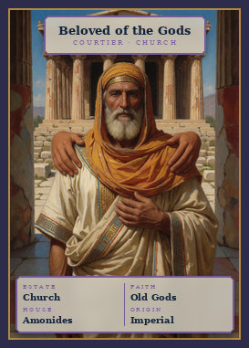 | **Beloved of the Gods** Card 01 | Courtier · Church | Church · Old Gods · Amonides · Imperial |
| 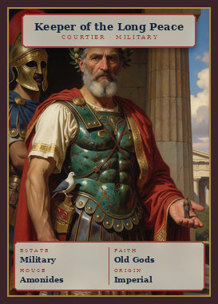 | **Keeper of the Long Peace** Card 02 | Courtier · Military | Military · Old Gods · Amonides · Imperial |
| 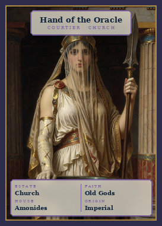 | **Hand of the Oracle** Card 03 | Courtier · Church | Church · Old Gods · Amonides · Imperial |
| 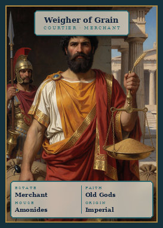 | **Weigher of Grain** Card 04 | Courtier · Merchant | Merchant · Old Gods · Amonides · Imperial |
| 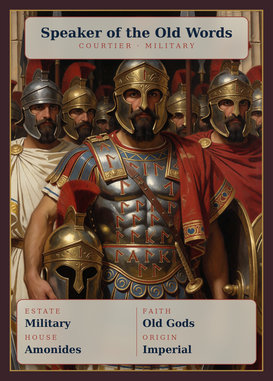 | **Speaker of the Old Words** Card 05 | Courtier · Military | Military · Old Gods · Amonides · Imperial |
| 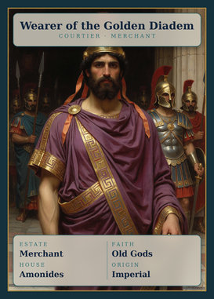 | **Wearer of the Golden Diadem** Card 06 | Courtier · Merchant | Merchant · Old Gods · Amonides · Imperial |
| 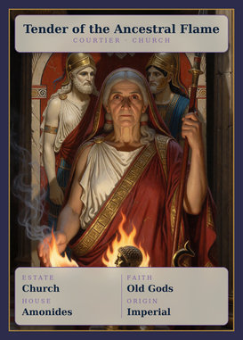 | **Tender of the Ancestral Flame** Card 07 | Courtier · Church | Church · Old Gods · Amonides · Imperial |
| 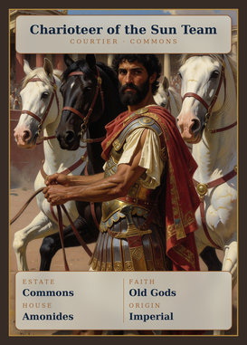 | **Charioteer of the Sun Team** Card 08 | Courtier · Commons | Commons · Old Gods · Amonides · Imperial |
| 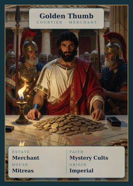 | **Golden Thumb** Card 09 | Courtier · Merchant | Merchant · Mystery Cults · Mitreas · Imperial |
| 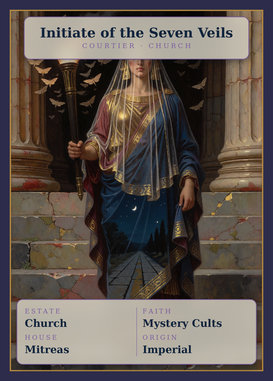 | **Initiate of the Seven Veils** Card 10 | Courtier · Church | Church · Mystery Cults · Mitreas · Imperial |
| 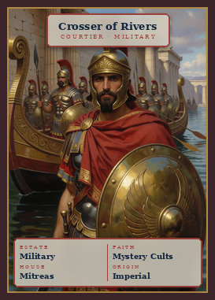 | **Crosser of Rivers** Card 11 | Courtier · Military | Military · Mystery Cults · Mitreas · Imperial |
| 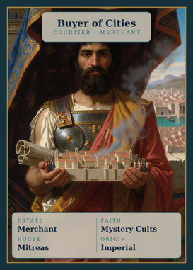 | **Buyer of Cities** Card 12 | Courtier · Merchant | Merchant · Mystery Cults · Mitreas · Imperial |
| 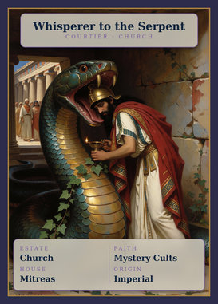 | **Whisperer to the Serpent** Card 13 | Courtier · Church | Church · Mystery Cults · Mitreas · Imperial |
| 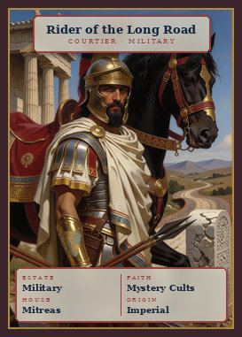 | **Rider of the Long Road** Card 14 | Courtier · Military | Military · Mystery Cults · Mitreas · Imperial |
| 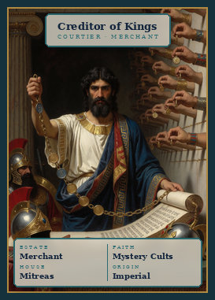 | **Creditor of Kings** Card 15 | Courtier · Merchant | Merchant · Mystery Cults · Mitreas · Imperial |
| 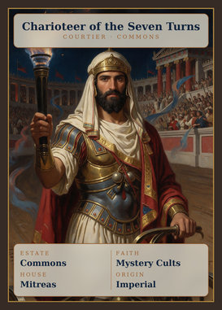 | **Charioteer of the Seven Turns** Card 16 | Courtier · Commons | Commons · Mystery Cults · Mitreas · Imperial |
| 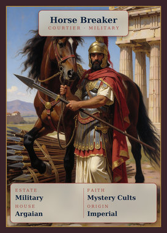 | **Horse Breaker** Card 17 | Courtier · Military | Military · Mystery Cults · Argaian · Imperial |
| 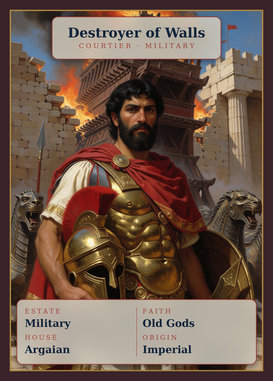 | **Destroyer of Walls** Card 18 | Courtier · Military | Military · Old Gods · Argaian · Imperial |
| 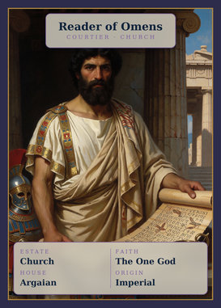 | **Reader of Omens** Card 19 | Courtier · Church | Church · The One God · Argaian · Imperial |
| 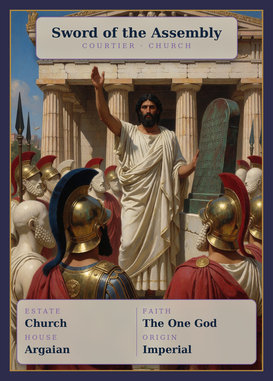 | **Sword of the Assembly** Card 20 | Courtier · Church | Church · The One God · Argaian · Imperial |
| 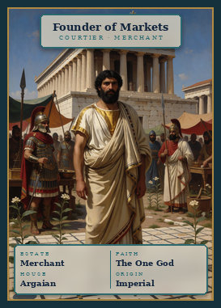 | **Founder of Markets** Card 21 | Courtier · Merchant | Merchant · The One God · Argaian · Imperial |
| 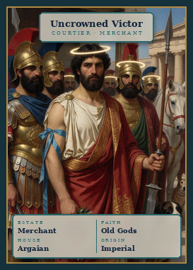 | **Uncrowned Victor** Card 22 | Courtier · Merchant | Merchant · Old Gods · Argaian · Imperial |
| 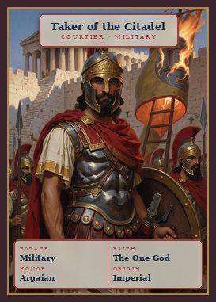 | **Taker of the Citadel** Card 23 | Courtier · Military | Military · The One God · Argaian · Imperial |
| 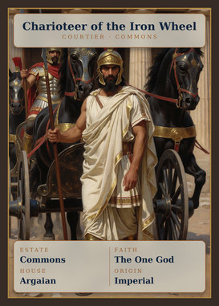 | **Charioteer of the Iron Wheel** Card 24 | Courtier · Commons | Commons · The One God · Argaian · Imperial |
| 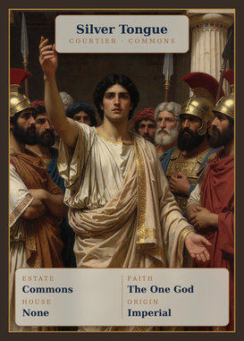 | **Silver Tongue** Card 25 | Courtier · Commons | Commons · The One God · None · Imperial |
| 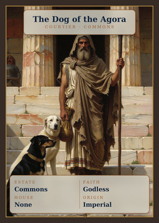 | **The Dog of the Agora** Card 26 | Courtier · Commons | Commons · Godless · None · Imperial |
| 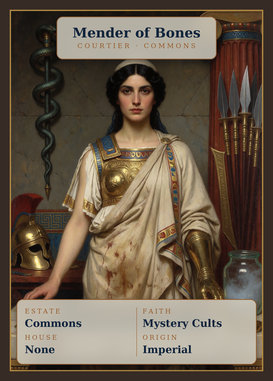 | **Mender of Bones** Card 27 | Courtier · Commons | Commons · Mystery Cults · None · Imperial |
| 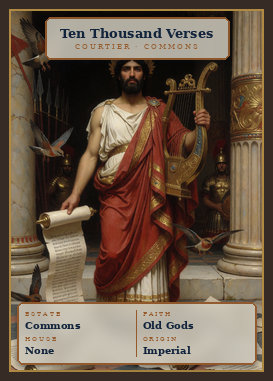 | **Ten Thousand Verses** Card 28 | Courtier · Commons | Commons · Old Gods · None · Imperial |
| 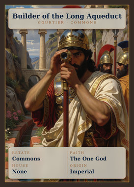 | **Builder of the Long Aqueduct** Card 29 | Courtier · Commons | Commons · The One God · None · Imperial |
| 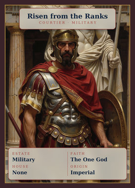 | **Risen from the Ranks** Card 30 | Courtier · Military | Military · The One God · None · Imperial |
| 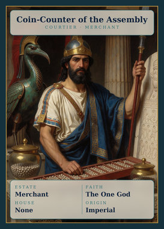 | **Coin-Counter of the Assembly** Card 31 | Courtier · Merchant | Merchant · The One God · None · Imperial |
| 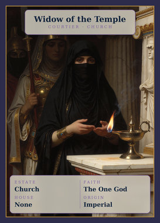 | **Widow of the Temple** Card 32 | Courtier · Church | Church · The One God · None · Imperial |
| 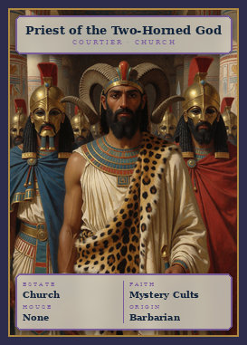 | **Priest of the Two-Horned God** Card 33 | Courtier · Church | Church · Mystery Cults · None · Barbarian |
| 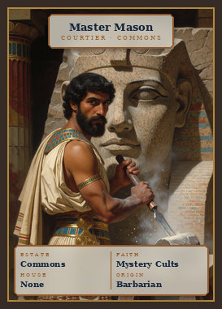 | **Master Mason** Card 34 | Courtier · Commons | Commons · Mystery Cults · None · Barbarian |
| 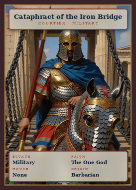 | **Cataphract of the Iron Bridge** Card 35 | Courtier · Military | Military · The One God · None · Barbarian |
| 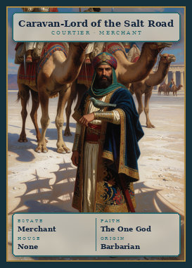 | **Caravan-Lord of the Salt Road** Card 36 | Courtier · Merchant | Merchant · The One God · None · Barbarian |
| 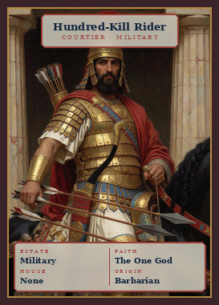 | **Hundred-Kill Rider** Card 37 | Courtier · Military | Military · The One God · None · Barbarian |
| 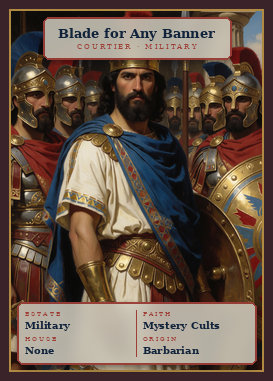 | **Blade for Any Banner** Card 38 | Courtier · Military | Military · Mystery Cults · None · Barbarian |
| 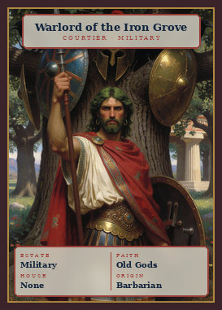 | **Warlord of the Iron Grove** Card 39 | Courtier · Military | Military · Old Gods · None · Barbarian |
| 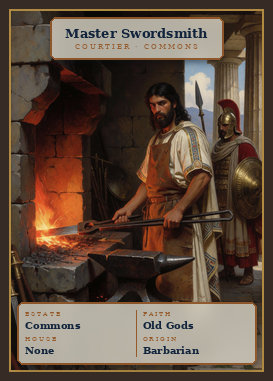 | **Master Swordsmith** Card 40 | Courtier · Commons | Commons · Old Gods · None · Barbarian |

## Event

Ten events in five minor/major pairs. An event hits the whole table rather than one courtier, and no Defense covers one.

| | Card | Type | What it does |
|---|---|---|---|
| 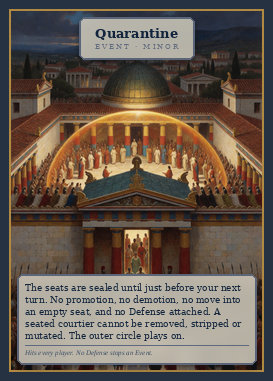 | **Quarantine** Card 41 | Event · Minor | The seats are sealed until just before your next turn. No promotion, no demotion, no move into an empty seat, and no Defense attached. A seated courtier cannot be removed, stripped or mutated. The outer circle plays on. |
| 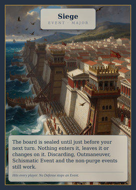 | **Siege** Card 42 | Event · Major | The board is sealed until just before your next turn. Nothing enters it, leaves it or changes on it. Discarding, Outmaneuver, Schismatic Event and the non-purge events still work. |
| 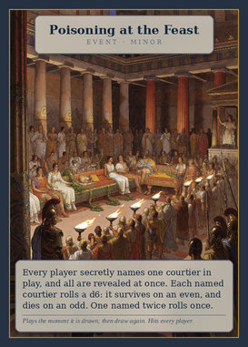 | **Poisoning at the Feast** Card 43 | Event · Minor | Starting with you and going clockwise, every player names one courtier in play, and that courtier dies. Each names against the board as it then stands. A named courtier rolls a d6 and survives on an even. |
| 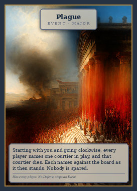 | **Plague** Card 44 | Event · Major | Starting with you and going clockwise, every player names one courtier in play, and that courtier dies. Each names against the board as it then stands. Nobody is spared. |
| 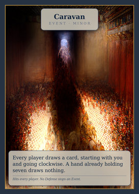 | **Caravan** Card 45 | Event · Minor | Every player draws a card, starting with you and going clockwise. A hand already holding seven draws nothing. |
| 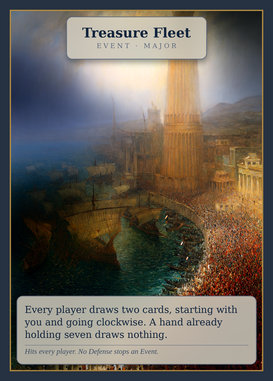 | **Treasure Fleet** Card 46 | Event · Major | Every player draws two cards, starting with you and going clockwise. A hand already holding seven draws nothing. |
| 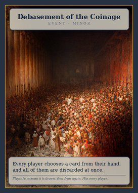 | **Debasement of the Coinage** Card 47 | Event · Minor | Every player discards a card, starting with you and going clockwise. |
| 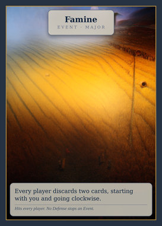 | **Famine** Card 48 | Event · Major | Every player discards two cards, starting with you and going clockwise. |
| 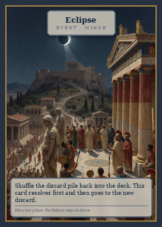 | **Eclipse** Card 49 | Event · Minor | Shuffle the discard pile back into the deck. This card resolves first and then goes to the new discard. |
| 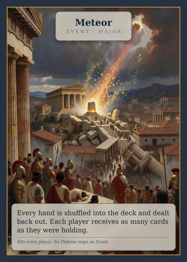 | **Meteor** Card 50 | Event · Major | Every hand is shuffled into the deck and dealt back out. Each player receives as many cards as they were holding. |

## Promotion

Takes an *occupied* seat of the named estate, bumping the sitting courtier out to the outer circle. The wildcard `Promotion` works on any estate.

| | Card | Type | What it does |
|---|---|---|---|
|  | **Promotion** Card 51 | Promotion · Any Estate | Move an outer-circle courtier into an occupied seat of their estate. The sitting courtier is bumped to the outer circle. |
|  | **Battlefield Promotion** Card 52 | Promotion · Military | Move an outer-circle Military courtier into an occupied Military seat. The sitting courtier is bumped to the outer circle. |
|  | **Consecration** Card 53 | Promotion · Church | Move an outer-circle Church courtier into an occupied Church seat. The sitting courtier is bumped to the outer circle. |
|  | **Royal Charter** Card 54 | Promotion · Merchant | Move an outer-circle Merchant courtier into an occupied Merchant seat. The sitting courtier is bumped to the outer circle. |
|  | **Acclamation** Card 55 | Promotion · Commons | Move an outer-circle Commons courtier into the Voice of the People's seat. The sitting courtier is bumped to the outer circle. |

## Demotion

Sends an inner-circle courtier out and leaves the seat empty.

| | Card | Type | What it does |
|---|---|---|---|
|  | **Demotion** Card 56 | Demotion · Any Estate | Send an inner-circle courtier to the outer circle. Their seat is left empty. |
|  | **Heresy Accusation** Card 57 | Demotion · Church | Send an inner-circle Church courtier to the outer circle. Their seat is left empty. |
|  | **Cashiering** Card 58 | Demotion · Military | Send an inner-circle Military courtier to the outer circle. Their seat is left empty. |
|  | **Charter Revoked** Card 59 | Demotion · Merchant | Send an inner-circle Merchant courtier to the outer circle. Their seat is left empty. |
|  | **Ostracism** Card 60 | Demotion · Commons | Send the Voice of the People to the outer circle. The seat is left empty. |

## Removal

Takes a courtier out of play. They go to the discard, so the epithet may return later on somebody new.

| | Card | Type | What it does |
|---|---|---|---|
|  | **Assassination** Card 61 | Removal · Any Estate | A courtier anywhere in play leaves play. They go to the discard and may return later as a new person with their printed attributes. |
|  | **Targeted Poisoning** Card 62 | Removal · Any Estate | A courtier anywhere in play leaves play, unless they roll a d6 and survive on an even. A Defense is spent before the roll is made. |
|  | **Martyrdom** Card 63 | Removal · Church | A Church courtier leaves play. They go to the discard and may return later as a new person with their printed attributes. |
|  | **Battlefield Betrayal** Card 64 | Removal · Military | A Military courtier leaves play. They go to the discard and may return later as a new person with their printed attributes. |
|  | **Bankruptcy** Card 65 | Removal · Merchant | A Merchant courtier leaves play. They go to the discard and may return later as a new person with their printed attributes. |
|  | **Mob Violence** Card 66 | Removal · Commons | A Commons courtier leaves play. They go to the discard and may return later as a new person with their printed attributes. |

## Defense

Attached to an inner-circle courtier ahead of time, paid for by sacrificing a courtier of the named estate from your hand. The estate constrains the *sacrifice*, not the courtier being guarded.

| | Card | Type | What it does |
|---|---|---|---|
|  | **Patron Protection** Card 67 | Defense · Any Estate | Sacrifice a courtier of any estate from your hand and attach this to any inner-circle courtier. It negates the first Removal, Demotion, Strip or Mutation aimed at them, then is discarded. It does not stop an Event. |
|  | **Sanctuary** Card 68 | Defense · Church | Sacrifice a Church courtier from your hand and attach this to any inner-circle courtier. It negates the first Removal, Demotion, Strip or Mutation aimed at them, then is discarded. It does not stop an Event. |
|  | **Bodyguard** Card 69 | Defense · Military | Sacrifice a Military courtier from your hand and attach this to any inner-circle courtier. It negates the first Removal, Demotion, Strip or Mutation aimed at them, then is discarded. It does not stop an Event. |
|  | **Deep Pockets** Card 70 | Defense · Merchant | Sacrifice a Merchant courtier from your hand and attach this to any inner-circle courtier. It negates the first Removal, Demotion, Strip or Mutation aimed at them, then is discarded. It does not stop an Event. |
|  | **Popularity** Card 71 | Defense · Commons | Sacrifice a Commons courtier from your hand and attach this to any inner-circle courtier. It negates the first Removal, Demotion, Strip or Mutation aimed at them, then is discarded. It does not stop an Event. |

## Strip

Empties an attribute. A strip does not spend the courtier's one mutation, so the slot can be filled again later.

| | Card | Type | What it does |
|---|---|---|---|
|  | **Castration** Card 72 | Strip · Family | A courtier's Family becomes None. They keep their seat. A strip does not spend a mutation, so Adoption can give them a family again. |
|  | **Excommunication** Card 73 | Strip · Faith | A courtier's Faith becomes None. They keep their seat. A strip does not spend a mutation, so Conversion can bring them to a faith again. |

## Mutation

Changes one attribute. Each attribute may be mutated at most once per courtier.

| | Card | Type | What it does |
|---|---|---|---|
|  | **Take Up the Sword** Card 74 | Mutation · Estate | A courtier's Estate becomes Military. If that un-matches the seat they hold, they are demoted to the outer circle at once. |
|  | **Take Vows** Card 75 | Mutation · Estate | A courtier's Estate becomes Church. If that un-matches the seat they hold, they are demoted to the outer circle at once. |
|  | **Enter Trade** Card 76 | Mutation · Estate | A courtier's Estate becomes Merchant. If that un-matches the seat they hold, they are demoted to the outer circle at once. |
|  | **Lose Status** Card 77 | Mutation · Estate | A courtier's Estate becomes Commons. If that un-matches the seat they hold, they are demoted to the outer circle at once. |
|  | **Conversion** Card 78 | Mutation · Faith | A courtier's Faith becomes any faith but their own; you choose it. A godless or excommunicated courtier may be brought to any of the three. |
|  | **Apostasy** Card 79 | Mutation · Faith | A courtier's Faith becomes Godless. Godlessness has no agenda, so their seat is one no faith can count. |
|  | **Go Native** Card 80 | Mutation · Origin | A courtier's Origin becomes Barbarian. |
|  | **Assimilate** Card 81 | Mutation · Origin | A courtier's Origin becomes Imperial. |
|  | **Adoption** Card 82 | Mutation · Family | Sacrifice a courtier of a family from your hand. The target takes that family as their own. |

## Pivot

Trades your agenda for one out of the pool nobody was dealt.

| | Card | Type | What it does |
|---|---|---|---|
|  | **Schismatic Event** Card 83 | Pivot | Discard your agenda and draw a new one from the pool of agendas nobody was dealt. The act is public; both agendas stay private. |

## Outmaneuver

The targeted player loses their next turn, draw included.

| | Card | Type | What it does |
|---|---|---|---|
|  | **Outmaneuver** Card 84 | Outmaneuver | The targeted player skips their next turn entirely, draw included. |

## Agenda

Four are dealt face down and four stay in the fog for a Schismatic Event to draw from. The thresholds printed here are the defaults in `succession/agendas.py`; a table running a variant should play off `docs/RULES.md` instead.

| | Card | Type | What it does |
|---|---|---|---|
|  | **House Rising: Amonides** Card 85 | House Amonides | Three or more of the seven inner seats are held by courtiers of House Amonides, at least one of them a Church seat -- the house's own estate. |
|  | **House Rising: Mitreas** Card 86 | House Mitreas | Three or more of the seven inner seats are held by courtiers of House Mitreas, at least one of them a Merchant seat -- the house's own estate. |
|  | **House Rising: Argaian** Card 87 | House Argaian | Three or more of the seven inner seats are held by courtiers of House Argaian, at least one of them a Military seat -- the house's own estate. |
|  | **Faith Ascendant: Old Gods** Card 88 | The Old Gods | Four or more of the seven inner seats are held by courtiers of the Old Gods. |
|  | **Faith Ascendant: Mystery Cults** Card 89 | The Mystery Cults | Four or more of the seven inner seats are held by courtiers of the Mystery Cults. |
|  | **Faith Ascendant: The One God** Card 90 | The One God | Four or more of the seven inner seats are held by courtiers of The One God. |
|  | **Barbarian Conquest** Card 91 | The Frontier | Three courtiers of Barbarian origin hold inner seats, in any estates. |
|  | **Balance** Card 92 | The Settlement | Six of the seven seats are filled, and the inner circle shows all three families, all three faiths, and two barbarians at once. |

## Seat

The board: seven chairs, laid out on the table for courtiers to be moved into. Each is bordered in its estate's colour, so a courtier matches its chair by edge alone. Church, Military and Merchant each seat an interchangeable pair; Commons seats one.

| | Card | Type | What it does |
|---|---|---|---|
|  | **Archpriest** Card 93 | Seat · Church | One of the two Church seats, which are interchangeable. Only a courtier whose current estate is Church may sit here. |
|  | **Oracle** Card 94 | Seat · Church | One of the two Church seats, which are interchangeable. Only a courtier whose current estate is Church may sit here. |
|  | **Lord General** Card 95 | Seat · Military | One of the two Military seats, which are interchangeable. Only a courtier whose current estate is Military may sit here. |
|  | **Captain of the Guard** Card 96 | Seat · Military | One of the two Military seats, which are interchangeable. Only a courtier whose current estate is Military may sit here. |
|  | **Keeper of the Treasury** Card 97 | Seat · Merchant | One of the two Merchant seats, which are interchangeable. Only a courtier whose current estate is Merchant may sit here. |
|  | **Master of the Market** Card 98 | Seat · Merchant | One of the two Merchant seats, which are interchangeable. Only a courtier whose current estate is Merchant may sit here. |
|  | **Voice of the People** Card 99 | Seat · Commons | The court's only Commons seat. A house reaches it solely through its charioteer, the one commoner it fields. |

## Card back

Shared by every card in the deck.

| | Card | Type | What it does |
|---|---|---|---|
|  | **Card back** Card 00 |  | Shared by every card in the deck. |

---

Generated by `python tools/mpcfill.py --profile docs`. Editing this file by hand will not survive the next build -- change `tools/card_text.py` or `tools/cardlist.py` instead.
